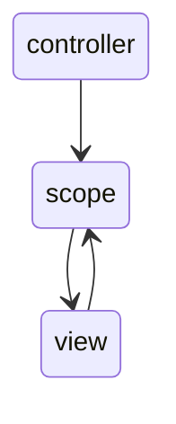

# Angular-course
#Angular.js
This is the start of angular js learning journey.
This document will serve as a note taking/experiment type of way.
I might have to 0revist some topics from the object course which I will put down below as well
Main writer:Anton Kopti


angular.js allows us to toss out spaghetti code and allows us to write out single page applicationds


what is angular?
angular is a javascript library, it is MV* framework
MV* :Model–view–controller is a software design pattern
commonly used for developing user

interfaces that divide the related program logic into
three interconnected elements. This is done to separate
internal representations of information from the ways
information is presented to and accepted from the user.


 it is also an opinionated software, which means it has
  a vision it guides us to doing things. it allows us to solve
  problem.

 angular allows us to manipulate dom inside of our directives

it gently guides us into doing certain things

*the m IN MV* stands for model which is where you store
the data and the state of our application


*the V is the view which is where you actually render to
to the user what information they can see and also receives
their input

* the star * in MV* framework stands for something else, like
controller, presenter, viewModel...etc

*angular uses teh controller so it can be called MVC

*angular is an open source library which was built by people
at google

angular is comprehensive, angular can sned and recieve data from
the backend this data is stored as plain javascript objects

it can also modify the DOM model, and can also do a two way routing

**********************************************************************
Angular thinks of HTML as a tool designed to build applications rather
than documents

Angular supports unit tests and end to end tests

Angular is forward thinking in the ways of web components and
Object.observe


##Angular Components
- with angular everything starts with controllers. controllers both contain the
logic and state
- the view/directives: tehy are made up of bindings and directives this is how
 this is how angular talks to and listens to users conteollers can communicate
 with views thorugh one way and 2 way binding
- services: give you a place to contain the main logic and state of your Application
complex buissness projects..etc is all housed in services

## building a hello world app using angular
````
<!DOCTYPE html>
<html lang="en">
<head>
    <meta charset="UTF-8">
    <title>Hello world</title>
</head>
<body>
<h1 ng-controller = "HelloWorldCtrl">{{helloMessage}}</h1>
<script src="angular.min.js"> </script>
<script type="text/javascript">
    function HelloWorldCtrl($scope)
    {
        $scope.helloMessage = "Hello World";
    }
</script>
</body>
</html>
````
##Angular EventReg
we will be learning about angular through building an application called Angular Event Reg
this is a showcase application and not an actual application, it will showcase what Angular can do 

- event reg is an application that allows us to make annual events or confrences and also allows us to vote for these events 

feautures of events include:
  1. List of angular Events 
  2. Event details including the list of sessions and details on these sessions 
  3. create New events and sessions 
  4. Edit events and sessions
  5. Login 
  6. we also be using a server 

##Angular seed 

- angular seed is a zip file that you download which acts as a starting point for the angular application


- it has some basic file orgenization, angular is buyilt for small applications, so the orgization is not that ocomplex. If you want to build a complex application you will have to reconfigure your orginization 


- it also includes a server but is small and we would want to expand the server 

###Quiz 

####When would you not want to use angular seeds?
- you would not want to use it on Pre-existing apps or large apps 

####Which directory will contain the files you will customize?
- inside the app directory 

####which file would you change to run the server on port 9000?
- web-server.js
------------------------------------------
#Modifying angular seed to start building our application 

######cleaned out the Tests
######we added bootstrap 
######we Modified the web server so it can work the way we want it for this course

##Quiz
1. Can modules depend on other modules?
       
        - yes,they can have other modular dependancies
   
2. should a small application use multiple modules?

        - no, in general small applications use just a singular module, but if we have a piece of our application that connects with another and if we have a testing we can split up 
----------------

#controllers and scope

we can not talk about controllers without talking about scopes 

a controller's primary responsibility is to create a scope object

A scope object is how you communicate with the view, and the scope communicates with the view through two way communication

the view combines the properties and the results of functions on the scope  and events on the view can call methods on the scope 

so data passes from the controller to the scope and back and forth from the scope to the view

the scope is used to expose the model to the view but the scope is not teh model, the model is the data that is put into the scope 

if you want to modify the model you can either use mothods that are on the scope to modify the model or using two way bindings we can modify the models

in this way the users can modify the model through the view with inoutted data


##Quiz

1. What is the primary responsibility of the controller

    -   create the scope 

2. is the scope the mode?

    -    No

3. Can the view bind to functions on the scope?

    -   yes

#starting to code 

##Hello World
So first things first, we must call on the angular library
```angular2html
<script src="angular.min.js"></script>
```
secondly, let's build a controller
```angular2html
<script type="text/javascript">
    function HelloWorldCtrl($scope) //we call a function and we usually end it with Ctrl
    {//we pass $scope variable within a function 
        $scope.helloMessage = "Hello World"; //this will then be how the fucntion is called which will output hello world 
    }
</script>
```
to use this we wrot ethe following tag:
```angular2html
<h1 ng-controller="HelloWorldCtrl">{{helloMessage}}</h1>
```
within our opening h1 tag we call our angular controller, or as abbreviated above ng-controller.
we then set it equal to our controller's name which in our case is HelloWorldCtrl.
Between our opening and ending h1 tags we put double brackets, this tells angular that we want it to go look for the the output of that key word.

if we run the code it will lead us to a web page with simply a Hello world text on the top left corner. 

the entire code would look like this:

```angular2html
<!DOCTYPE html>
<html lang="en">
<head>
    <meta charset="UTF-8">
    <title>Hello world</title>
</head>
<body>
<h1 ng-controller = "HelloWorldCtrl">{{helloMessage}}</h1>
<script src="angular.min.js"> </script>
<script type="text/javascript">
    function HelloWorldCtrl($scope)
    {
        $scope.helloMessage = "Hello World";
    }
</script>
</body>
</html>
```
##Starting to build my application

After setting up my angular seed, I must declare my application. This is done in the app.js file:

```angular2html
    var eventsApp = angular.module('eventsApp',[]);
```

And then I create a vanilla HTML file and call it EventDetail.html, and since I need a controller I will creat a js file inside my JS directori / inside my controller directory.

so I will create my controller which will contain most of the details about the event and it will look like this:

```javascript
'use strict';

eventsApp.controller('EventController', //we start with AppName.controller('nameOfTheCtrl',
    function EventController($scope) { 
    $scope.event = {
        name: 'Angular Boot Camp',
        date: '1/1/2013',
        time: '10:30 am',
        location: {
            address: 'Google Headquarters',
            city: 'Mountain View',
            province: 'CA'
        },
        imageUrl: '/img/angularjs-logo.png'}
}
);  
``` 
######fig-alpha-
this is the structure of our controller

```
'use strict'

   NameOfApp.controller('NameOfCtrl',
    function NameOfCtrl($scope)
    {
        $scope.ObjectName
        {
            //content of the object
        }
    }
   );
```
then let's go to the HTML and see what we have to do there. after tagging all of our scripts and finishing with all of the vanilla code we must write we go to the body of the HTML and write the following to call on our angular controller:

```html
<div ng-controller="EventController">
    <div class="container">
        <div class="'row">
            <h2>{{event.name}}</h2>//this will output the event name from our contreoller in the angular file
        </div>
    </div>
</div>
```
Above is the material needed to understand what we did, but to grasp a better picture of what we did to our HTML file, here is the code below:

```html
<!doctype html>
<html lang="es" ng-app="eventsApp">
<head>
    <meta charset="utf-8">
    <title>Event Registration</title>
    <link rel="stylesheet" href="css/bootstrap.min.css">
    <link rel="stylesheet" href="css/app.css">
</head>
<body>
<div class="container">
    <div class="navbar-inner">
        <ul class="nav">

        </ul>
    </div>

    <div ng-controller="EventController">
        
        <div class = "row">
            <div class="spann11">
                <h2>{{event.name}}</h2>
            </div>
        </div>
        <div class="row">
            <div class="span3">
                <div><strong>Date:</strong>{{event.date}}</div>
                <div><strong>Date:</strong>{{event.time}}</div>
            </div>
        </div>
        <div class="span4">
            <address>
                <strong>Address:</strong><br>
                {{event.location.address}}<br>
                {{event.location.city}}, {{event.location.province}}
            </address>
        </div>
    </div>
</div>

<!--the script tags required for JS-->
<script src="lib/jquery.min.js"></script>
<script src="lib/underscore-1.4.4.min.js"></script>
<script src="lib/bootstrap.min.js"></script>
<script src="lib/angular/angular.js"></script>
<script src="js/app.js"></script>
<script src="js/controllers/EventController.js"></script>
</body>
</html>
```
##Populating the page some more

we will learn how to add repeating infortmation unto a page. Primarily we must add this repetitive information to our controller. this is done like so:

we will be going inside fig-alpha-
```javascript
sessions:  [
    {name:"Directive",creatorName: 'Bob Smith', duration: '1hr', level:'advanced'},
    {name:"Directive",creatorName: 'Bob Smith', duration: '1hr', level:'advanced'},
    {name:"Directive",creatorName: 'Bob Smith', duration: '1hr', level:'advanced'},
]
```
After doing so we can go back to our HTML and add this information using ng-repeat:

```html
<div class="thumbnails">
    <li ng-repeat="'session in event.sessions">
        <div class="row session">
            <h1>{{session.name}}</h1>
            <h6>{{session.creatorName}}</h6>
            <h6>{{session.duration}}</h6>
            <h6>{{session.level}}</h6>
        </div>
    </li>
</div>
```

from the above we can see that we did not have to repeat these for all components of the session but it did that by itself.
this is all because we put the `ng-repeat` inside of our `<li></li>` tag.

now the attribute for `ng-repeat` is equal to `sessions in event.sessions`. this is creating an object that will do our repetition. we are calling for all sessions in event.sessions.

it will give us something that looks like this:


##Interacting with the page

So we want to make an upscale voting system for the events in the sessions.

we first go to our controller and add a upvoteCount variable inside the objects inside the session object. we will set them all equal to zero.`upvoteCount=0`.

This will be our counter. We now must make methods to append or decrement the counters. This is done like this:

```javascript
    $scope.upVoteSession = function(session) {
        session.upVoteCount++;
    };

    $scope.downVoteSession = function(session) {
        session.upVoteCount--;
    }
```
The first function, when called, accesses the upVoteCounter data from the session's objects and appends it, the next one decrements.

Lastly, we must add it to our HTML file. I will be adding a cheveron with an up and down button and in between will be the number of the counter. This must be repeated through the different sessions which is why it must be added to the `ng-repeat` div tag.

so to add the first the up cheveron this is what we must do:
```Html
<div class="'span0 well votingWidget">
    <div class="votingButton" ng-click="upVoteSession(session)">
        <i class="icon-chevron-up icon white"></i>
    </div>
</div>
```
Disregaridng the twitter bootstrap, we focus our attention to the `ng-click="upVoteSessions(session)`. Since this is inside a div class with the `ng-controller` declared already it will in a way inherit the fact that we are inside EventController ng-controller. Afterwards we will go to the function declared `upVoteSession(session)` which will be executed once the chevron button is clicked, this is ensured by the `ng-click`.

We do the same thing for the down vote icon button.  but in the middle we must display teh number of votes.

```html
<div class="badge badge-inverse">
    <div>{{session.upvoteCount}}</div>
</div>


```
our final code inside the `ng-repeat` looks like this:
```html
<div class="'span0 well votingWidget">
    <div class="votingButton" ng-click="upVoteSession(session)">
        <i class="icon-chevron-up icon white"></i>
    </div>
</div>
<div class="badge badge-inverse">
    <div>{{session.upvoteCount}}</div>
</div>
<div class="'span0 well votingWidget">
    <div class="votingButton" ng-click="downVoteSession(session)">
        <i class="icon-chevron-up icon white"></i>
    </div>
</div>
```
###Quiz 

1. Can you use basic javascrip objects as your model in Angular?

        - yes, Angular does not require special objects 
   
2. What is the markup indicator for binding data to a view?

        - `{{}}` The double curly brace

3. Which directive do you use to bind an image's src?

        - ngSrc

##Built0In Directives

 - Directives are ways to teach HTML new tricks, essentially angular directives give HTML new functionality 

we have already seen a few directives such as `ng-click`. this was an attribute of a tag but there are three ways to specify directives with angular:

    1. first one is a tag itself, for example: `<ng-form />`
    
    2. An attribute of a tag, such as `<div ng-form />`
    
    3. finally, we can write directives as a class: <div class="ng-form" />

Often times a directive can only be writeen in one or two of these forms and not all of them.

##Event Directives

directives that handles events 

1. ng-click
2. ngDBClick //ng Double Click
3. ngMousedown
4. ngMouseenter
5. ngMouseleave
6. ngMousemove 
7. ngMouseover
8. ngMouseup
and finally we have
9. ngChange

an example of ngChange:

```html
<input type="checkbox" ng-change="'handleChange()" ng-model="'property" />
```

####The bind directives
 the bind directives are: 
        1. ngBind
        2. ngBindTemplates
        3. ngBindHtml
        4. ngBindHtmlUnsafe

For `ngBind`, let's take out web page title for example previously it looked like this:
```html
<div class="spann11">
    <h2>{{event.name}}</h2>
</div>
```
with `ngBind` it would look like this:
```html
<div class="span11">
    <h2 ng-bind="event.name"></h2>
</div>
```
this is will output the same thing as the previous one with just the `{{event.name}}` syntax.

Let us now look at the `ng-bind-template` syntax. This is the same as the one abovebut we can add more stuff.

for example:
```html
<div class="span11">
    <h2 ng-bind-template="{{event.name}} {{event.date}}"></h2>
</div>
```
now let's talk about the `ngBindHtml` directive, which we must do a couple of things before we implement it. This is because it is the angular sanitary file and not in our original angular script file.

In our HTML we must first add our script tag leading to file for this directive:

`<Script src="lib/angular/angular-sanitize.js"></script>`

then let's go to our app.js which is located in `angular-seed-0.10.x/app/js`.

inside we will fin dthe dollowing code:
```javascript
'use strict';

var eventsApp = angular.module('eventsApp', []);

```
we want to add a dependancy to our application and our code will be: 

```javascript
'use strict';

var eventsApp = angular.module('eventsApp', ['ngSanitize']);
```

in our HTML we add the following div:

```javascript
<div ng-bind-html="snippet">some title</div>
```

in our Javascript EventController.js file I will the following line of code inside out EventController functions:

```javascript
$scope.snippet ='<soan style="color:red">hi there</span>';
```


as we can see it did not output the hi there with a red color that is because the style part of the html is seen as dangerous by the sanitize.js.

But if our html is coming from a trustable source we can use the `ngBingHtmlUnsafe`

the code would look like this:

```javascript
<div ng-bind-html-unsafe="snippet">some title</div>
<div ng-bind-html="snippet">some title</div>
```
this would look like this:


we can notice that the hi there is now red, this is because added the unsafe directive and it showed teh style color regardless of whetehr it is safe or not. 

####Hid and Show

to add these, we will go into our controller and add a boolean:
```javascript
$scope.boolValue = true;
```

now let's create a couple of `<h2>` tags to test this out:

```html
<h2 ng-show="boolValue">Show this</h2>
<h2 ng-hide="boolValue">hide this</h2>
```

This is a good stop to reiterate the primary points of angular which is to only manipulate the DOM with directives and never manipulate it within our controller. The counter of this would create brittle code. 

####ng Cloak

This directive allows us to hide the page while angular goes through and parses the HTML and replace the directives or binding with the actual value it is supposed to display. 

this is good because without it, it may show flashes of things that were not supposed to be there before Angular activates everything.

the simplest way to do this is to add it to our body tag:
```html
<body ng-cloack>

<!--some code-->

</body>
```

once we do this, we will need to go to our css file (app.css) and we need to add the following css rule:

```css
[ng\:cloak],[ng-cloak], [data-ng-cloak], [x-ng-cloak], .ng-cloak, .x-ng-cloak{display:none;}
```

the alternative to this is to move our angular script tag up to the head rather than at the end of the body.

####ng-style

let's take any <h2> tag and add this tag to them:

```html
<div class="span11">
    <h2 ng-style="mystyle" ng-bind-template="{{event.name}} {{event.date}}"></h2>
</div>
```

and then we go back to our controller and add a myStyle Variable:

```javascript
$scope.mystyle = {color:'red'};
```

I have set my `$scope.mystyle` to an object that is actually a CSS command and we can see that it made the <h2> red:


####ngClass-Even or Odd

they are companions to the style directive and they work just like class only we use it inside the `ng-repeat` directive and they apply only to the even or odd directive.

so if I go back to my Controller I wanna add this variable:
```JavaScript
$scope.myclass="blue";
```
and then I go to my app.css file and add the following:

```css
.blue{
    color:"blue";
}
```
and instead of teh style directive we used earlier I will add teh `my-class` directive:

```html
<div class="span11">
    <h2 ng-class="mystyle" ng-bind-template="{{event.name}} {{event.date}}"></h2>
</div>
```

and the output would look like this:


###Quiz

True or False: ngBind supports, multiple bindings:

    - False: The ngBindTemplate directive does.

##Other Directive

1. ngDisabled 
2. ngChecked 
3. ngMultiple 
4. ngReadOnly
5. ngSelected

Let's play with `ng-disabled` directive by inputting into a html button:

```html
<button class="'btn" ng-disabeled="buttonDisabled">Disabled</button>
```

And then let's add that to  c 2222 our controller by writing the following code:

```javascript
$scope.buttonDisabled = true;
```

what we would get is this: 


the button is unclickable and is now disabled.

`ngForm` teh reason we have this is because the html specs does not allow forms to be nested but if we want sections to have different forms.

`ngSubmit` is a lot like the event directive that we saw earlier only it allows you to call a method on ur scope if the form is submitted.

`ngHref` is the same as the href for an anchor tag and the `ngSrc`

the src directive allows the browser to wait a few minutes 


the `ngNonBindable` directive it specifies an area for angular to not parse. this is for instances that look like an angular code but we are telling angular not to parse anything inside of it   

for example let's say we have:

```html
<div>{{1+2}}</div>
```

This will output 3 but if we don't want that to happen we can just say:

```html
<div ng-non-bindable> {{1+2}} </div>
```

this will output {{1+2}}.

##Expressions

They are Javascript like code snippets that you can input inside of the HTML page. 

they are generally placed inside of our bindings and typically they are variable names we have inside of our scope. but they can incorprate more than just a variable name such as a mathematical expression: `{{100-70+1}}`.

expressions are not full JS syntax, you can not call a method for example. 

a nice example you might need to know is making an array and calling out a specific part of your array: `[1,2,3][2]` this would output 3.
 
 #Filters

######Filters are a way for you to tell angular that you want to modify something for output 

- filters can do three things:
        
        - Formatting: this might include things upper case or formating dates..etc

        - Sorting Datasets: sort records in a datasets.

        - Filtering Datasets

####Using filter in angular 

the following is a good example of how filter can be applied to an expression:
```html
{{{expression | filter}}
```

###Built in feautures

Let's first look at the following:

1. uppercase
2. lowercase

example:
```html
<div class="spann11">
    <h2>{{event.name | upercase}}</h2>
</div>
```
this will make all the letters uppercase

we Also have the following:

- number 
  ```html
<div>{{3.143246 | number:2}}</div> //this will output 3.14
```
- currency 
- date
        when we have a javascript date we can do `{{event.date | date: 'mediumDate'}}`
-Json

the last three are used in the `ng-repeat` which re 

- orderBy
- limitTo
- filter

lets try some of these out:

we can go to our `ng-repeat` div and add the orderBy

```html
 <li ng-repeat="session in event.sessions | orderBy: sortOder">
```
then we go to our controller and add the following parameter:

```javascript
$scope.sortOrder ='name';
```
by default, angular will sort our data using the ame field/

we can also change it to upvotecount which will sort according to the order in which we upvote sessions, but it will come out in reverse so we add the `-` to make it in he order of biggest to smallest

```javascript
$scope.sortOrder = '-upVoteCount';
```

What we if we want to allow the user to change the sort order according to a different variable.

so let's go to our HTMML and add a drop down:

```html
Order By:
<select ng-model="sortOrder"class="input-small">
    <option selected value="name">Name</option>
    <option value="-upVoteCount">Votes</option>
</select>
```
this will be the output:


####the LimitTo filter

This is if we want to show a limited number of sessions within a filter. for exaple if we wanna alter the sessions list to only show 2 sessions at a time:

```html
 <li ng-repeat="session in event.sessions | orderBy: sortOder | limitTo:2">
```

Let's give the users an ability to filter through the sessions by difficulty to do that we have to go back to the html and add the following:

```html
show:
<select ng-model="query"class="input-small">
    <option selected value=''>All</option>
        <option selected value='Introductory'>Introductory</option>
    <option selected value='Intermediate'>Intermediate</option>
    <option selected value='Advanced'>Advanced</option>
</select>
```

afterwards we have to specifify that i our `ng-repeat` div by adding the pipe and the query attributes:
```html
 <li ng-repeat="session in event.sessions | orderBy: sortOder | limitTo:2">
```

since the default is not passed we do not have to add any values to our controller but rather angular sifts through our data and reads simmiliar values and displays them accordingly. if we want to avoid mistakes made by angular will go back to our controller and add the attributes we are filtering.

we can add an `evets.level` to each of our sessions and specify the parameters and then in our drop down menue we can then make our `ng-model="query.level" which will allow angular to look through the sessions and select only those with the secific parameters 

##Writing a custom Filter

to start writing a custom filter we should look at the template to create one:

```javascript
module.filter('name', function()
{
    return function(input /*, filter parameters */){
        //modify input
        return modifiedOutput
    }
});
```

we want to make a filter that will take in an integer for duration rather than a string and then output a string such as 'half an hour' or 'entire day'.

to start I go into my controller and change the values of the duration for each session to integers from 1 to 4. For example:

```javascript
{
   name: 'Scopes for fun and profit',
   creatorName: 'John Doe',
   duration: 2,
   level: 'Introductory',
   abstract: 'This session will take a closer look at scopes. Learn what they do, how they do it, and how to get them to do it for you.',
   upVoteCount: 0
}
```
Now that we have the data set up correctly I wanna go to my filters.js file and actually write the filter. Inside this file I will write this:

```javascript
eventsApp.filter('durations', function(){
    return function(duration)
    {
        switch(duration)

        {
            case 1:
                return 'Half Hour';
            case 2:
                return '1 Hour';
            case 3:
                return 'Half day';
            case 4:
                return: 'Full Day';
        }
    }
});
```
this is a simple filter that takes in values from 1-4 and returns the strings shown above. 

as you can see we passed the apps name and then called the filter method and then we wrote it out like how we used to write it down before.

now to activate that filter we must go back to the html doc and add the following script:

```html
<script src="js/filters.js"></script>
```

now we should ass that filter to a bidning: ( look at the arrow for reference)

```html
<h4 class="well-title">{{session.name}}</h4>
<h6 style="margin-top:-10px">{{session.creatorName}}</h6>
<h6 style="margin-top:-10px">{{session.duration | durationa}}</h6> <!-- <---------- -->
<h6 style="margin-top:-10px">{{session.level}}</h6>
<p>{{session.abstract}}</p>
```


we can see that our durations changed from their text values to the ones we specified

##Two way binding

this allows us to use the two way form controls and keep our model up to date automatically as this is a very useful thing since we do not need to write the code to read the contets

this capability revolves around the 'ngModel' directive. this directive woks with three different html elemebts. 

1. input
2. select
3. textArea

the template for using the model directive: 
```html
<input type="text" ng-model="'object.property" />
```

##demo Two way binding

we are going to make a page that allows users to create events:


